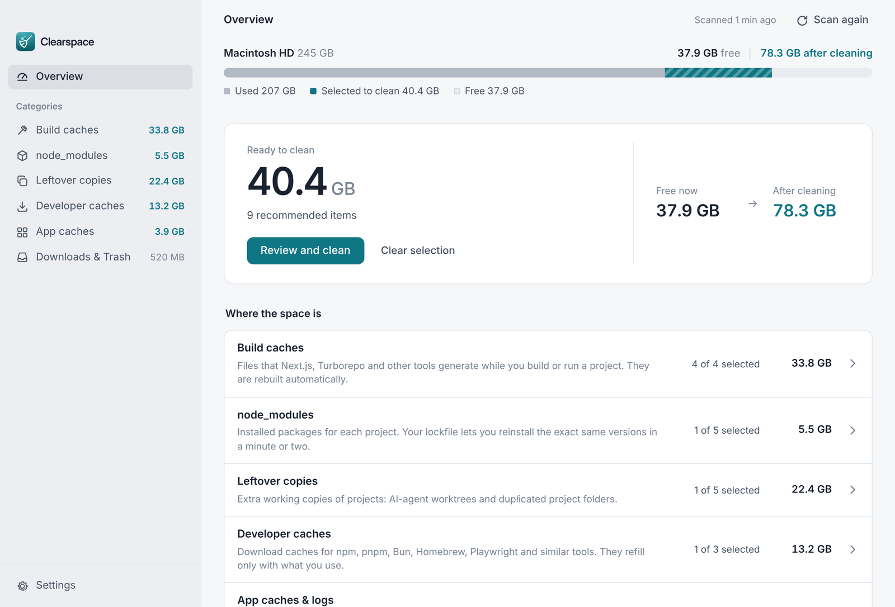
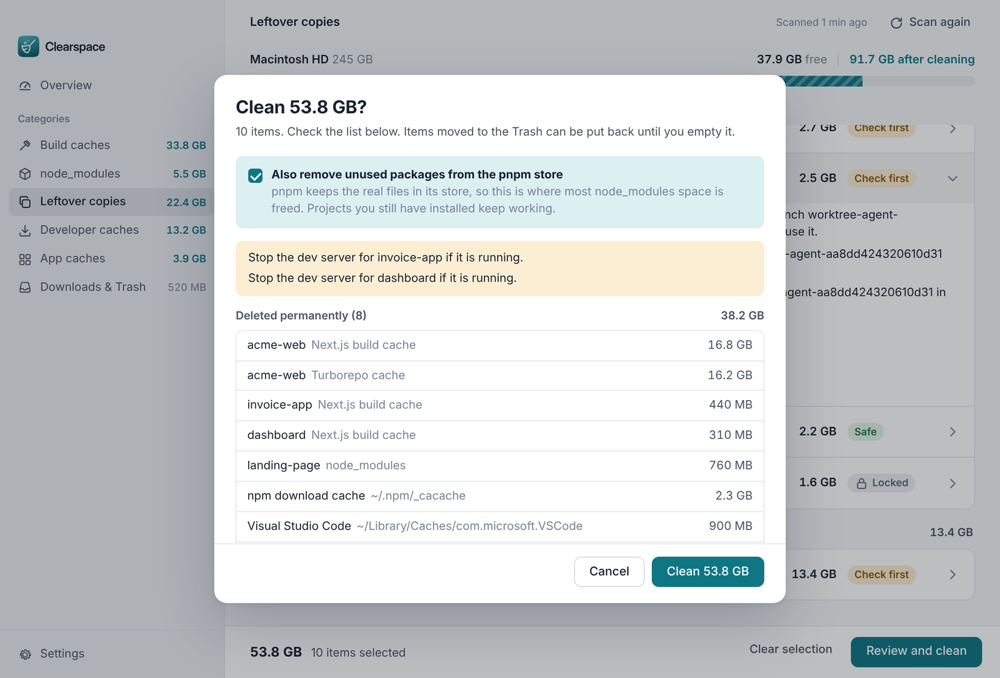

<h1 align="center">
  <picture>
    <source media="(prefers-color-scheme: dark)" srcset="docs/brand/clearspace-logo-white.svg">
    
  </picture>
</h1>

<p align="center">
  Free up disk space on your Mac without the fear of deleting something you need.<br>
  Clearspace finds build caches, <code>node_modules</code>, leftover AI-agent worktrees and app caches,<br>
  explains every item in plain language, and cleans only what you approve.
</p>

<p align="center">
  
</p>

## Install

You need macOS 12 or later, [Node.js](https://nodejs.org) 18 or later and git (already on most developer Macs). Open Terminal and run:

```bash
git clone https://github.com/deveripon/clearSpace.git && cd clearSpace && bash install.sh
```

The script builds the app, signs it for your Mac, installs **Clearspace** into `/Applications`, removes the build files and opens it. It takes a few minutes the first time.

**Update** to the latest version:

```bash
cd clearSpace && git pull && bash install.sh
```

**Uninstall:**

```bash
rm -rf /Applications/Clearspace.app ~/Library/Application\ Support/Clearspace
```

## Using it

1. Open Clearspace. It scans your project folders and caches, which takes about a minute.
2. Items marked **Safe** that you are not actively using are already selected. Click any row to see:
   - **What it is**
   - **After cleaning**: what changes, for example "run `pnpm install` before you work on it again"
   - **Will you lose anything?**
3. Click **Review and clean**, read the list, then **Clean**.

The result shows how much free space you actually gained, measured on the disk rather than estimated.

On first launch, open **Settings** and check the project folders. By default Clearspace uses whichever of `~/Projects`, `~/Developer`, `~/Code`, `~/dev`, `~/Sites`, `~/work` and `~/src` exist.

<p align="center">
  
</p>

## What it cleans

| Category | Examples | Selected for you |
|---|---|---|
| **Build caches** | `.next`, `.turbo`, `.nuxt`, `.svelte-kit`, `.parcel-cache`, `.angular`, coverage reports | Yes |
| **node_modules** | Grouped per project or monorepo | Only projects unused for 14+ days (adjustable) |
| **Leftover copies** | AI-agent worktrees in `.claude/worktrees`, `.codex/worktrees` and `.conductor/worktrees`; duplicate "project copy" folders | Only clean worktrees with nothing unpushed and no recent activity |
| **Developer caches** | npm, Bun, Yarn, Homebrew, pip, Electron, Xcode DerivedData; `pnpm store prune` | Yes, except Playwright, Cypress, `~/.cache` and pnpm prune |
| **App caches & logs** | Chrome, VS Code, Slack, Discord, Cursor and other known-safe caches; `~/Library/Logs` | Only caches on the known-safe list |
| **Downloads & Trash** | Large files in Downloads; your Trash | Never |

## How it keeps your work safe

Clearspace was built for one rule: **never delete anything you need.** Every protection below is covered by automated tests (see [Testing](#testing)).

**You decide**
- Nothing is cleaned without the review step. The reviewed list is frozen while it is open, and the Cancel button has focus by default.
- Anything that is not clearly disposable is marked **Check first** and is never preselected. Anything risky is **Locked** and can't be selected at all.
- Duplicate project folders and Downloads go to the **Trash**, so you can put them back.

**Every path is checked twice**
- The second check runs right before cleaning. A path must:
  - still be the same kind of folder (same device and inode),
  - be inside your home folder,
  - not go through a symbolic link anywhere along the way,
  - not be a protected folder (home, Library, Documents, Desktop, Downloads, iCloud, your project folders).
- Only items from the latest scan can be cleaned. The app's window can send nothing but item ids.

**Git work is protected**
- An AI-agent worktree is **locked** if it has:
  - uncommitted or untracked changes (even with `status.showUntrackedFiles=no`),
  - ignored files that are not identical copies of your main project's (such as a unique `.env`),
  - tracked files hidden with skip-worktree or assume-unchanged,
  - a nested git repository,
  - commits on a detached HEAD,
  - a `git worktree lock`.
- Worktrees are removed with `git worktree remove`, never `--force`. Branches stay in your repo.
- Commits that only a worktree's own history knows about are first saved as `refs/clearspace-backup/<worktree>/<sha>`, so nothing becomes unreachable.
- Worktrees with git activity in the last 24 hours are not preselected, since an agent may still be working there.
- `node_modules` and build folders that git tracks are never offered. If git can't tell, they are treated as tracked.
- Folders that contain a git repository (for example a cloned package) are locked.
- Git runs with hooks and `core.fsmonitor` disabled and never takes index locks.

**Never touched**
- Apple caches (`~/Library/Caches/com.apple.*`)
- Application Support, Containers, Group Containers, iCloud Drive, CloudStorage
- `.app` bundles and hidden tool folders such as `~/.nvm` and `~/.vscode`
- your home folder itself as a project folder

## Good to know

- **pnpm projects.** Deleting `node_modules` frees little on its own, because pnpm shares package files with its store. When you clean pnpm `node_modules`, Clearspace offers **Unused packages in the pnpm store** (`pnpm store prune`), which is where the space really comes back.
- **First-run prompts.** macOS may ask to let Clearspace read Downloads. Measuring and emptying the Trash needs Full Disk Access: open Settings and choose **Open System Settings**.
- **Why build it yourself?** Clearspace isn't notarized by Apple. Building it on your own Mac with `install.sh` signs it locally, so macOS opens it normally.

## Development

```bash
npm install
npm start      # run without installing
npm test       # engine + safety tests in a throwaway fake home folder
```

```
engine/     scan.js (what can be cleaned), clean.js (checks + cleaning), worktree.js (git safety),
            catalog.js (plain-language descriptions, known-safe lists), util.js
main.js     window, menu and IPC (accepts only item ids from the latest scan)
preload.js  the bridge between window and engine
renderer/   the interface (plain HTML, CSS and JavaScript)
test/       engine.test.js, safety.test.js, fixtures and UI screenshot script
```

The engine is plain Node.js with no runtime dependencies. Electron and electron-builder are only needed to run and package the app.

## Testing

`npm test` builds throwaway fake home folders and runs two suites:

- **engine.test.js:** scanning and cleaning a realistic setup, including:
  - inactive and active projects
  - monorepos
  - clean, dirty, relative-path and detached worktrees
  - duplicate folders
  - symlink traps
- **safety.test.js:** a regression test for every issue found in the security reviews:
  - symlinked `~/Library/Caches`, `~/.cache` and Downloads
  - folders swapped for symlinks between scan and clean
  - nested repositories, including cloned packages inside `node_modules`
  - vendored `node_modules`
  - broken repositories and git missing from PATH
  - reflog-only commits
  - locked worktrees and fsmonitor hooks
  - non-English file names
  - partial failures

During development the engine also went through three independent review rounds. These included a fuzz run of more than 1,300 randomly generated folder layouts, which found no unintended deletions in its final rounds.

## Contributing

Contributions are welcome. Please read [CONTRIBUTING.md](CONTRIBUTING.md) first, especially the safety rules.

## License

[MIT](LICENSE) © 2026 Ripon (deveripon)

Clearspace comes with no warranty. It is designed to be careful, but you are responsible for what you choose to clean. Keep backups (Time Machine or similar) of anything important.
